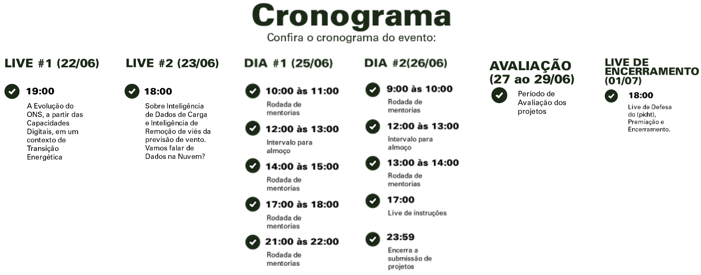

  
  
  
  
  

# Hackathon de Dados - ONS

  <a href="#Cronograma">Cronograma</a> •
  <a href="#Desafio">Desafio</a> •
  <a href="#Material">Material</a> •
  <a href="#Projeto">Projeto</a> •
  <a href="#Ferramentas">Ferramentas</a> •
  <a href="#Integrantes">Integrantes</a> •
  <a href="#Licença">Licença</a>

### Cronograma

 

### Desafio

Analisar os efeitos das temperaturas nas cargas das regiões de São Paulo a fim de estabelecer uma relação mais apropriada entre a carga global de São Paulo e as temperaturas de cada região.

### Material

- [Vídeo Pitch](#)
- [Apresentação Power Point](#)
- [Link da Solução](#)

### Projeto

Foi utilizado o google colab para . . . . .

### Ferramentas

<ul>
  <li>Colab</li>
  <li>GitHub</li>
  <li>Discord</li>
  <li>CamtasiaStudio</li>
  <li>Python</li>
</ul>

### Integrantes

<table>
  <tr>
    <td> Alex</td>
    <td> Everton</td>
    <td> Isaac</td>
    <td> Gustavo</td>
  </tr>
  <tr>
    <td><a href="https://www.linkedin.com/in/engalexlourenco/" target="_blank">Linkedin</a></td>
    <td><a href="encurtador.com.br/jrMT3" target="_blank">Linkedin</a></td>
    <td><a href="https://www.linkedin.com/in/isaac-camargos-945833207/"  target="_blank">Linkedin</a></td>
    <td><a href="https://www.linkedin.com/in/gustavopereiradias/" target="_blank">Linkedin</a></td>
    </tr>
  </table>

### Licença

Esse projeto está sob a licença MIT. Veja o arquivo [LICENSE](LICENSE) para mais detalhes.
